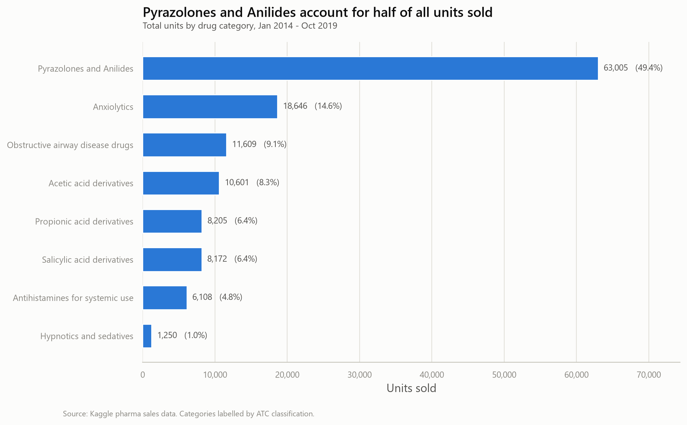
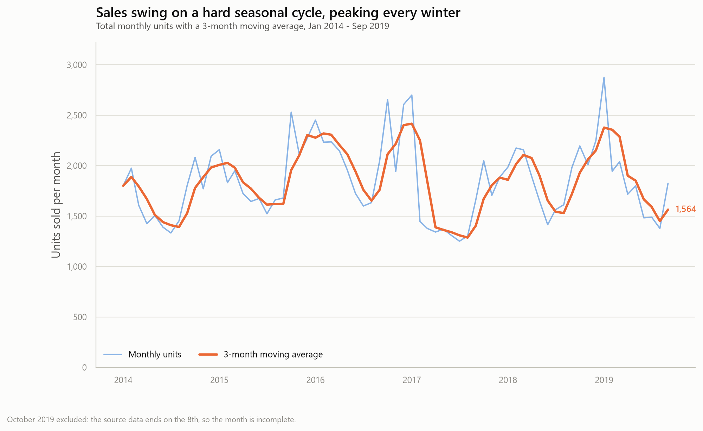
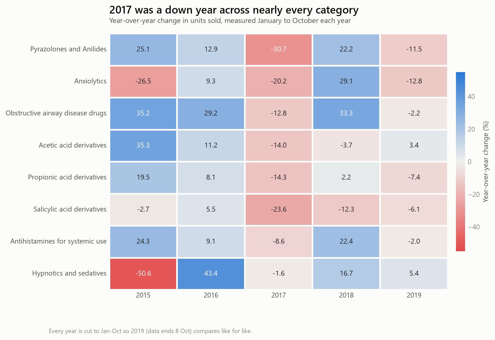

<div align="center">

# Pharma Sales Analytics

**Six years of pharmacy sales, turned into a decision-ready analytics pipeline.**


</div>

An end-to-end analysis of six years of pharmacy sales data — from raw CSVs through a
cleaning pipeline, into a SQL database, and out as charts that answer actual business
questions. Also includes a 3-page project website and a Power BI extension on the
same data model.

---

## Contents

- [Objective](#objective)
- [The data](#the-data)
- [Pipeline](#pipeline)
- [The SQL](#the-sql)
- [Findings](#findings)
- [Project website](#project-website)
- [Power BI dashboard](#power-bi-dashboard)
- [Methodology notes](#methodology-notes)
- [Running it](#running-it)
- [Repository layout](#repository-layout)

---

## Objective

A pharmacy chain sitting on six years of point-of-sale data wants to know three things:

1. **Where does the volume actually come from?** Which drug categories are worth
   planning inventory around, and which are rounding errors.
2. **When does demand arrive?** Is there a seasonal pattern strong enough to staff
   and stock against.
3. **What is growing and what is dying?** Which categories are in structural decline
   versus having one bad year.

This project answers all three, and shows the working.

---

## The data

Source: [Pharma Sales Data](https://www.kaggle.com/datasets/milanzdravkovic/pharma-sales-data)
on Kaggle — six years of transactions from a single pharmacy, aggregated to hourly,
daily, weekly and monthly grain.

- **Period:** 2 January 2014 → 8 October 2019
- **Grain:** 2,106 days / 50,532 hours / 302 weeks / 70 months
- **Measure:** units sold

Columns arrive as ATC codes, which are unreadable on a chart axis, so the pipeline
maps them to a proper dimension table:

| ATC code | Drug category | Group |
|---|---|---|
| M01AB | Acetic acid derivatives | Anti-inflammatory / Antirheumatic |
| M01AE | Propionic acid derivatives | Anti-inflammatory / Antirheumatic |
| N02BA | Salicylic acid derivatives | Analgesics / Antipyretics |
| N02BE | Pyrazolones and Anilides | Analgesics / Antipyretics |
| N05B | Anxiolytics | Psycholeptics |
| N05C | Hypnotics and sedatives | Psycholeptics |
| R03 | Obstructive airway disease drugs | Respiratory |
| R06 | Antihistamines for systemic use | Respiratory |

---

## Pipeline

```
data/raw/archive/        4 raw CSVs, straight from Kaggle
        |
        |   clean_data.py      parse dates, drop the junk column, reshape
        v
data/cleaned/            6 tidy CSVs, including a long-format fact table
        |
        |   sql_queries.py     load to SQLite, run the analysis
        v
pharma_sales.db          6 tables + indexes
        |
        |   visualize.py       read the same queries back out
        v
visualizations/          3 PNGs
```

### Stage 1 — Cleaning (`clean_data.py`)

The interesting work here was not missing values (there were none — worth checking
rather than assuming) but three structural problems:

- **Three different date formats.** The daily, weekly and hourly files use `M/D/YYYY`;
  the monthly file uses `YYYY-MM-DD`. Each is parsed with an explicit format string
  rather than letting pandas guess, because silent misparsing of `1/12/2014` as
  12 January versus 1 December is the kind of bug that survives all the way to a chart.
- **A junk column.** `salesdaily.csv` carries an `Hour` column holding values like 248
  and 276 — a leftover sum from whatever produced the file, not an hour of the day.
  Dropped from the daily table, kept in the hourly one where it means something.
- **Wide format.** Eight drug-code columns are fine in a spreadsheet and miserable in
  SQL, where every "top category" question becomes an eight-way `UNION`. The script
  melts the daily table into a long fact table (`date`, `atc_code`, `units`) and emits
  the ATC lookup as a dimension table alongside it.

Output: six files in `data/cleaned/`, including `sales_long.csv` (16,848 rows) and
`drug_categories.csv`.

### Stage 2 — SQL (`sql_queries.py`)

Loads the cleaned CSVs into `pharma_sales.db` and indexes the fact table. All four
analyses are done **in SQL** — window functions, CTEs and joins — with pandas used
only to read results back for display.

### Stage 3 — Charts (`visualize.py`)

Imports the query definitions from `sql_queries.py`, so the charts and the terminal
output are guaranteed to be reading the same numbers.

---

## The SQL

**Ranking categories by share of total volume** — a window function for the rank, a
scalar subquery for the denominator:

```sql
SELECT
    d.drug_name,
    ROUND(SUM(s.units), 1)                                               AS total_units,
    ROUND(100.0 * SUM(s.units) / (SELECT SUM(units) FROM sales_long), 2) AS pct_of_total,
    RANK() OVER (ORDER BY SUM(s.units) DESC)                             AS sales_rank
FROM sales_long s
JOIN dim_drug d ON d.atc_code = s.atc_code
GROUP BY d.atc_code, d.drug_name
ORDER BY total_units DESC;
```

**Year-over-year growth, on a like-for-like window.** The data stops on 8 October 2019,
so comparing full calendar years would show every category collapsing by roughly a
quarter — an artefact of the data ending, not a business event. Cutting every year to
January–October makes the comparison honest:

```sql
WITH ytd AS (
    SELECT s.atc_code, d.drug_name, s.year, SUM(s.units) AS units
    FROM sales_long s
    JOIN dim_drug d ON d.atc_code = s.atc_code
    WHERE s.month <= 10                       -- like-for-like, every year
    GROUP BY s.atc_code, d.drug_name, s.year
),
compared AS (
    SELECT drug_name, year, units,
           LAG(units) OVER (PARTITION BY atc_code ORDER BY year) AS prev_units
    FROM ytd
)
SELECT drug_name, year,
       ROUND(units, 1)                                     AS ytd_units,
       ROUND(100.0 * (units - prev_units) / prev_units, 1) AS yoy_pct
FROM compared
WHERE prev_units IS NOT NULL
ORDER BY drug_name, year;
```

**Smoothing the seasonal noise** with a trailing 3-month window:

```sql
WITH monthly AS (
    SELECT strftime('%Y-%m', date) AS month, SUM(units) AS units
    FROM sales_long
    GROUP BY strftime('%Y-%m', date)
)
SELECT month,
       ROUND(units, 1) AS units,
       ROUND(AVG(units) OVER (
           ORDER BY month ROWS BETWEEN 2 PRECEDING AND CURRENT ROW
       ), 1) AS moving_avg_3m
FROM monthly
ORDER BY month;
```

The fourth query tracks month-over-month change using `LAG()` over the same monthly CTE.

---

## Findings

### 1. Half the business is one drug category



**Pyrazolones and Anilides (N02BE) are 49.4% of all units sold** — 63,005 units against
18,646 for the next category down. Six of the eight categories are under 10% each, and
Hypnotics and sedatives are 1.0%.

*Why it matters:* inventory and supplier negotiation should be concentrated, not spread
evenly across the catalogue. It is also a concentration risk — a supply disruption in a
single ATC class would hit roughly half of unit throughput.

### 2. Demand is seasonal, and the swing is large



Averaged across all six years, **January runs about 59% above July** (2,328 units versus
1,460). The peak is consistently winter — January, December, February — with a reliable
summer trough from June through August. October is the surprise: it is the second
strongest month of the year, suggesting demand starts climbing well before winter proper.

The 3-month moving average is what makes this readable; the raw monthly line swings hard
enough to hide the underlying level.

*Why it matters:* this is a staffing and stock-level calendar. Ordering to a flat annual
average guarantees stockouts in January and dead capital in July.

### 3. 2017 was a bad year almost everywhere — and one category is genuinely dying



Reading the heatmap by row rather than by cell is where the story is:

- **2017 is a red column across seven of eight categories** — N02BE fell 30.7%, Anxiolytics
  20.2%, Salicylic acid derivatives 23.6%. A downturn that broad is unlikely to be eight
  separate product problems; it points at something structural that year (a supply,
  pricing or footfall event) worth investigating outside this dataset.
- **2018 recovered most of it**, with N02BE up 22.2% and Obstructive airway drugs up 33.3%.
- **Salicylic acid derivatives (N02BA) are the real concern.** Negative in four of its five
  comparison years, and three years running to close: −23.6%, −12.3%, −6.1%. It is also the
  only category that did not participate in the 2018 rebound. Every other category has solid
  up years mixed in; this one does not, which reads as substitution rather than a bad year.
- **Hypnotics and sedatives show the wildest percentages** (−50.6%, then +43.4%), but on
  roughly 1% of total volume those are small absolute movements. This is why the chart is
  sorted by volume rather than by growth — percentage swings on a tiny base are noise
  dressed up as signal.

*Why it matters:* N02BA should be reviewed for delisting or replacement; the 2017 dip needs
a root-cause investigation before it is treated as a trend.

---

## Project website

A 3-page site walks through all of this interactively — Home, a Methodology page with the
full cleaning code and all four SQL queries in sortable, live output tables, and a Results
page with the charts and a recommendations table. It's plain HTML/CSS/JS, no build step.

```bash
cd site
python -m http.server 8000     # then open http://localhost:8000
```

## Power BI dashboard

The same star schema behind the SQL analysis extends directly into Power BI —
`sales_long` and `dim_drug` are already a fact table and a dimension, so the data model
didn't need a rewrite, just a proper date dimension added alongside them.

`powerbi/build_powerbi_extract.py` generates the import-ready files in `powerbi/`:

| File | Rows | Role |
|---|---|---|
| `fact_sales.csv` | 16,848 | Date, ATCCode, Units |
| `dim_drug.csv` | 8 | ATCCode, DrugName, DrugGroup |
| `dim_date.csv` | 2,191 | One row per calendar day, 2014–2019 in full — not just the days with sales |

`dim_date` deliberately spans complete calendar years rather than only the ~2,106 days
with actual transactions. Power BI's time-intelligence functions (`SAMEPERIODLASTYEAR`,
`DATESINPERIOD`) need a contiguous date table, or year-over-year calculations silently
go wrong at year boundaries.

Four DAX measures mirror the SQL layer — `Total Units`, `% of Total`, `YoY %` (via
`SAMEPERIODLASTYEAR`), and a `3M Moving Avg` (via `DATESINPERIOD` + `SUMMARIZE`). The
full walkthrough — relationships, the `MonthName`/`WeekdayName` sort-order fix, all four
measures, and the three planned report pages — is in
[`powerbi/POWERBI_GUIDE.md`](powerbi/POWERBI_GUIDE.md), with more detail on the
[site's Power BI page](site/powerbi.html).

**Status:** the data package and guide are finished; the interactive `.pbix` is in progress.

---

## Methodology notes

- **The partial final month.** The source data ends on 8 October 2019. October is therefore
  eight days long and shows a −70.5% month-over-month "drop" that is purely an artefact.
  It is excluded from the trend chart and neutralised in the YoY query by the Jan–Oct
  window. It is left in the raw and cleaned data rather than deleted.
- **Missing values.** The cleaning script checks for and reports nulls and duplicates. This
  dataset had none — the counts print as zero rather than the script implying it repaired
  something. Where a quantity *is* missing, the fill is `0` (nothing dispensed), not a mean,
  which would invent sales that never happened.
- **Units, not revenue.** The dataset has no price column, so "top-selling" throughout means
  by volume. A high-volume, low-margin category is not necessarily the most valuable one.

---

## Running it

```bash
git clone https://github.com/CyberSamurai-04/Pharma_Sales_Analytics.git
cd Pharma_Sales_Analytics

pip install -r requirements.txt

python clean_data.py     # raw -> data/cleaned/
python sql_queries.py    # build pharma_sales.db, print the analysis
python visualize.py      # write the charts to visualizations/
```

Run them in that order — each stage reads the previous stage's output.

## Repository layout

```
.
├── clean_data.py             cleaning and reshaping
├── sql_queries.py            database build + the four analytical queries
├── visualize.py              the three charts
├── requirements.txt
├── data/
│   ├── raw/archive/          untouched Kaggle CSVs
│   └── cleaned/              pipeline output
├── visualizations/           generated PNGs
├── site/                     the 3-page project website (home, methodology, results, power bi)
└── powerbi/                  star schema extract, date dimension, and the Power BI build guide
```

`pharma_sales.db` is gitignored — it is rebuilt from the cleaned CSVs by `sql_queries.py`.

---

**Subham Kumar Sahoo** · [github.com/CyberSamurai-04](https://github.com/CyberSamurai-04)
